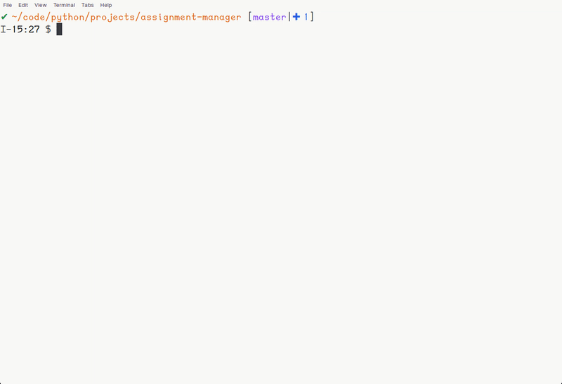

# Assignment Manager

A terminal based assignment-manager written in python.
It can also handle both one-time tasks and reoccuring
assignments. Also allows you to track your progress.

<p align="center">
    
</p>

## Prerequisites

All you need in order to use this repo is `python>=3.8`.
Note that there are some python dependencies, however
most of them should be available for all OS's.

## Installation

If you have [pipx](https://pypa.github.io/pipx/), run

```
pipx install assignment-manager
```

otherwise you can just run

```
pip install assignment-manager
```

Note that if you are using `pip`, you may want to
[setup a venv](https://docs.python.org/3/library/venv.html).

## Usage

You use the following two keywords as entry points

```
assman
assignment-manager
```

To view the help panel, write

```
$ assman --help

 Usage: assman [OPTIONS] COMMAND [ARGS]...                                                          

╭─ Options ────────────────────────────────────────────────────────────────────────────────────────╮
│ --install-completion        [bash|zsh|fish|powershell|pwsh]  Install completion for the          │
│                                                              specified shell.                    │
│                                                              [default: None]                     │
│ --show-completion           [bash|zsh|fish|powershell|pwsh]  Show completion for the specified   │
│                                                              shell, to copy it or customize the  │
│                                                              installation.                       │
│                                                              [default: None]                     │
│ --help                                                       Show this message and exit.         │
╰──────────────────────────────────────────────────────────────────────────────────────────────────╯
╭─ Commands ───────────────────────────────────────────────────────────────────────────────────────╮
│ add                                                                                              │
│ backup                                                                                           │
│ remove                                                                                           │
│ rename                                                                                           │
│ show                                                                                             │
│ update                                                                                           │
╰──────────────────────────────────────────────────────────────────────────────────────────────────╯
```
